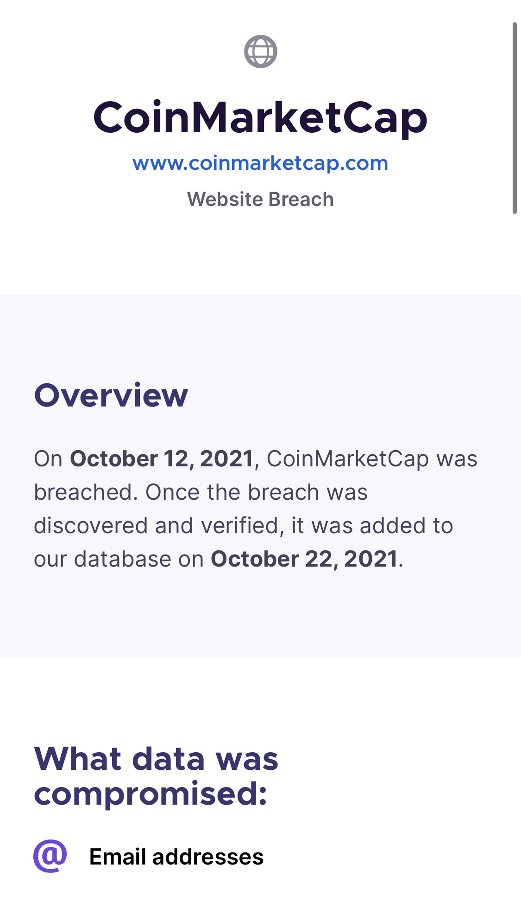
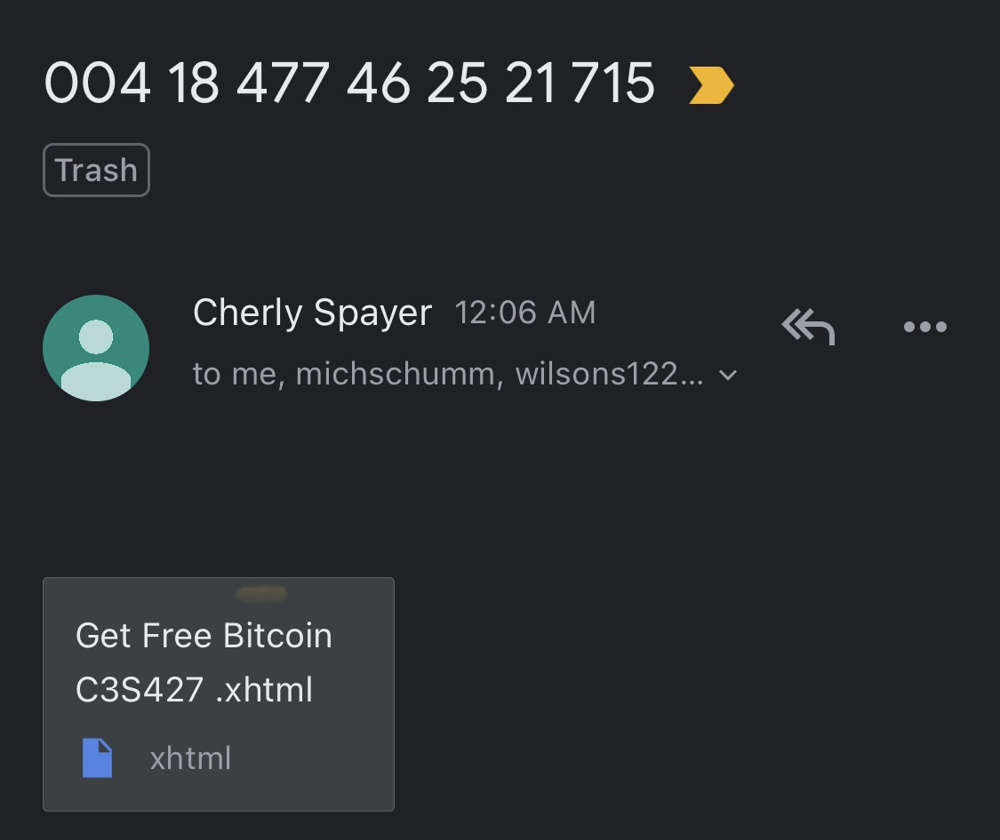
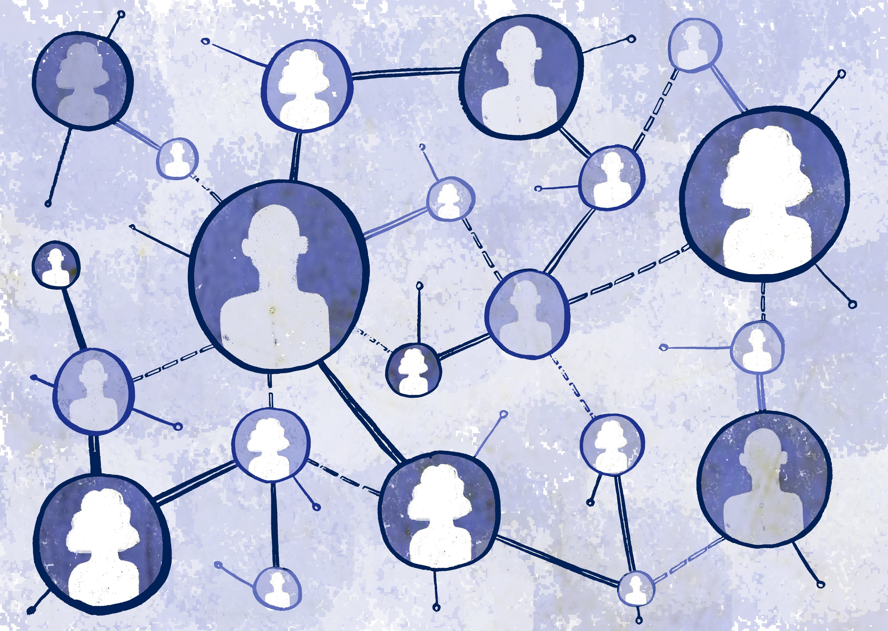

The most recent data breach happened to CoinMarketCap , and almost 3.1 million user emails (including mine) were compromised.

<figure>

<figcaption>

Mozilla’s Firefox Monitor added the breach to their database today (October 22nd, 2021) (source: [Firefox Monitor](https://monitor.firefox.com/))

</figcaption>

</figure>

I have noticed a big wave of phishing attempts (especially related to Cryptocurrencies) started about a week ago.

<figure>

<figcaption>

An example phishing email received today

</figcaption>

</figure>

This will be followed by more tailored attempts that might replicate emails coming from major banks and/or crypto exchange platforms… **BE AWARE !**

  
Take extra caution while opening any email, when in doubt, don’t open the link on the email, always head into the official website, and always remember: “**_it it’s too good to be true, it’s a scam_**”.

In matter of fact, I have decided a while ago, to not give my personal email to any website no matter how important it is, I am using Apple iCloud+ feature “Hide My Email”, to those who don’t know about it: it is a feature used while signing up via Apple, where your actual email is hidden and a dummy email is created for the purpose of using it just for that particular website. The emails received from that website will be forwarded to your actual address by Apple. This gives a massive boost to your security, and if -god forbids- your email was leaked, it won’t harm you in any sort.

There are similar services provided by other trusted providers like Mozilla for instance (check Firefox [Relay](https://relay.firefox.com)).

Data breach is a very serious issue, even if your passwords aren’t compromised, yet hackers could use all the data gathered about you to have more targeted attacks. Lately, the number of data breaches and scraps happened is very alerting, this raises the question whether the websites (especially those providing paid services) are maintaining high standards in terms of cyber security? why there isn’t forcible laws that regulates compensations to the victims of those breaches, especially if the data breached led to an attack that caused a loss (of any kind) to the victim.

Finally, this kind of a situation, leads the way for more efforts of separating the personal data from the website/service provider. I’m thinking of a decentralized and highly secure technology that retains the ownership of all personal data to the users themselves, where websites and services communicates and requests a timely access to certain information that relates exclusively to the service they provide. The session of data access would only last while the user is actively using the service (i.e. during the service session).

<figure>

<figcaption>

Source: [Mozilla Foundation](https://foundation.mozilla.org/en/initiatives/new-york-city-internet-health-report/decentralization-/)

</figcaption>

</figure>

I hope this idea will turn into reality one day, and that everyone will take back control again over their own data. Because what is happening nowadays is merely a crime; one does not know how much of his personal data is exposed, sold, or analysed without his consent.
