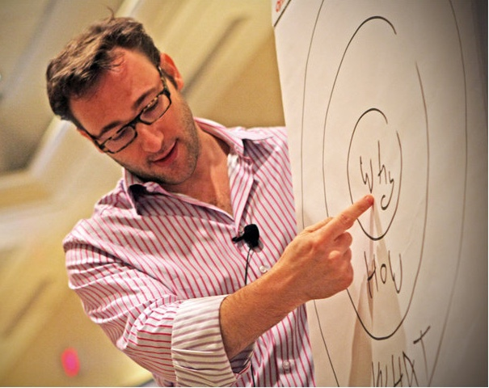
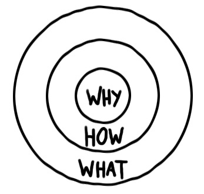

Few days ago, I reviewed the book “[Start with Why](https://husainalghasra.com/2021/08/11/start-with-why-simon-sinek/)” by the author and public speaker Simon Sinek. This book is based on a TED talk titled **“How Great Leaders Inspire Action****” an**d discusses a simple yet powerful concept for inspirational leadership.

“_I made a discovery. And this discovery profoundly changed my view on how I thought the world worked, and it profoundly changed the way in which I operate in it_”, Simon said at the beginning of his speech.

<figure>

<figcaption>

_Simon Sinek explaining his discovery of the golden circle._

</figcaption>

</figure>

According to Simon, it is a way of communication, a naturally occurring pattern, a way of thinking and acting that gives some leaders the ability to inspire those around them. It's true that some are "natural-born" leaders who come into the world with a preference for inspiring others. But this doesn't mean that others can't learn to lead. In fact, I believe that leadership is more of a science that, like any other discipline, can be taught to any desirable recipient.

As a matter of fact, leadership, although usually used in a positive context, is not exclusively reserved for righteousness. On the contrary, we can list countless examples of immoral and dishonest leaders who, beyond any doubt, played a major role in history and affected the course of humanity throughout the years.

This takes us back to the simplest question we could ask: **What is leadership?**

If we conducted a poll, I can almost guess that the majority of the participants would list motivation as the one word most suitable to be linked with leadership. Therefore, it is natural to conclude that the mere definition of leadership, according to this hypothesis, is "**The ability to motivate.**" But is it the right assumption, though?

Different people are motivated by a variety of different reasons, including fear. The fear of being penalised motivates people to finish their job within the deadline. Embarrassment, on the other hand, can motivate people to act in a certain way in a given situation. And, above all, someone's authority can admittedly motivate people to follow orders.

Throughout my career, I have worked with different managers who, by closely following up with their subordinates, collecting reports, conducting weekly meetings, and setting deadlines, presumed that this would entitle them to the status of good leadership. However, in reality, they had only mastered the way of getting things done from others, i.e., the very basic definition of management. In fact, some of those managers used to manipulate and take advantage of others' hard work for personal gain. It's true that these individuals are also considered leaders. In fact, every manager, boss, or anyone with established authority is considered a leader by assignment. So how can we distinguish between good and bad leadership models?

I spent hours researching before concluding that inspirational leadership is widely considered the best trait of leadership that identifies a good leader. Inspirational leadership, at its core, is about exploring ways to boost the potential of those you lead in a way that works for them and inspiring others to push themselves and reach their potential. Inspiring leaders are those who use their unique abilities to make individuals and teams believe in their vision and understand the bigger picture. They spark their team's self-motivation to take on bold missions and recognize their results. They unlock their best performances through empowerment, not command and control.

**Motivation vs Inspiration**

Many people think that motivation and inspiration are more or less the same thing. Well, they aren't. Although both disciplines can lead somehow to the same result, there are fundamental differences between both terms.

**Motivation** is the word derived from the word ‘motive’, and according to [MSG](https://www.managementstudyguide.com/what_is_motivation.htm): _it is the process of stimulating people to act in a way to accomplish a goal_. While **inspiration** is derived from ‘inspire’ and is defined as _an act of influencing people mentally and emotionally to do something creative._ In other words, motivation is a push force that is usually short-lived to achieve a pre-defined goal, and is externally imposed on us, while inspiration on the other hand, is a pull force that is supposed to be everlasting, sourced from within, and tends to form an ultimate purpose for doing things.

In my opinion, inspiration can lead to continuous self-motivation, therefore causing better results in the long run. That is what distinguishes businesses such as Apple and Tesla from others; it is their ability to inspire employees and customers alike in a way that forms some sort of loyalty to the company and its products. But the question is: since we established that inspiration is sourced from within, then how can someone inspire others? How can organisations spread influence to hundreds or thousands of employees in a way they all center around a mutual vision? To answer this question, we need to go back to Simon Sinek's discovery that he called "_**The Golden Circle**_."

**The Golden Circle**

According to Simon Sinek, there is a pattern in place. As it turns out, all the great inspiring leaders and organizations in the world think, act, and communicate the exact same way, which is the complete opposite of everyone else. To better understand this, he presented this concept in a term he called "The Golden Circle." There are three parts of the Golden Circle: Why, How, and What.

**What:** Every single person or organisation on the planet knows what they do. Every organisation can easily describe the products or services they sell, and every person can easily describe the job function they have within the company.

**How:** Some people or companies know how they do what they do, i.e., how they make it different or better than the competitors. In the case of individuals, it is the ability to describe how they perform their job in a way that achieves the desirable outcomes.

**Why:** This is the tricky part; there are only a few people or organizations that can clearly articulate why they do what they do. This isn't about making a profit or getting a promotion, in the case of individuals; that's a result. Why is all about your purpose. Why does your company exist? What's your belief? Why do you get out of bed in the morning?

In general, all typical leaders think, act, and communicate from the outside in. They clearly identify the desired results and outcomes. Some of them put policies and operating manuals in place to pinpoint how you perform the job, but most of them disregard the last point, that is to elucidate the purpose. I have to point out that "It is required by top management" doesn't count as one.

This type of leaders may, to some extent, get the required job done, but they would never inspire their employees or unlock their full potential. Inspirational leaders and organizations, on the other hand, do it completely the opposite way by communicating from the inside out; **they start with why!**

Inspirational leaders or organisations always start by explicating the purpose. They first communicate why they're doing what they do, or why they need people to do what they ask them to do. Once that is clearly established, the other two parts are filled naturally because defining the purpose will inspire others to bring out the best potential in themselves. They may come up with out-of-the-box suggestions on how to perform the required job better or how to get a better version of the outcome. They will instinctively understand the impact of deadlines and plan themselves better because they've already realized how a delay, for instance, interrupts the collective outcome and thus affects the main purpose.

When leaders think, act, and communicate from the inside out, they tap into our innate drive and synchronize shared values and beliefs. They make us feel special, like we belong to something bigger, and thus we feel a sense of tribe affiliation with all the others toward a mutual purpose, and much more glorious results.

To conclude, I quote Simon Sinek again: _“There are leaders, and there are those who lead. Leaders hold a position of power or authority, but those who lead inspires us. Whether they are individuals or organisations, we follow those who lead, not because we have to, but because we want to. We follow them for ourselves, not for them. And it’s those who start with “Why” that have the ability to inspire those around them or find others who inspire them”._
