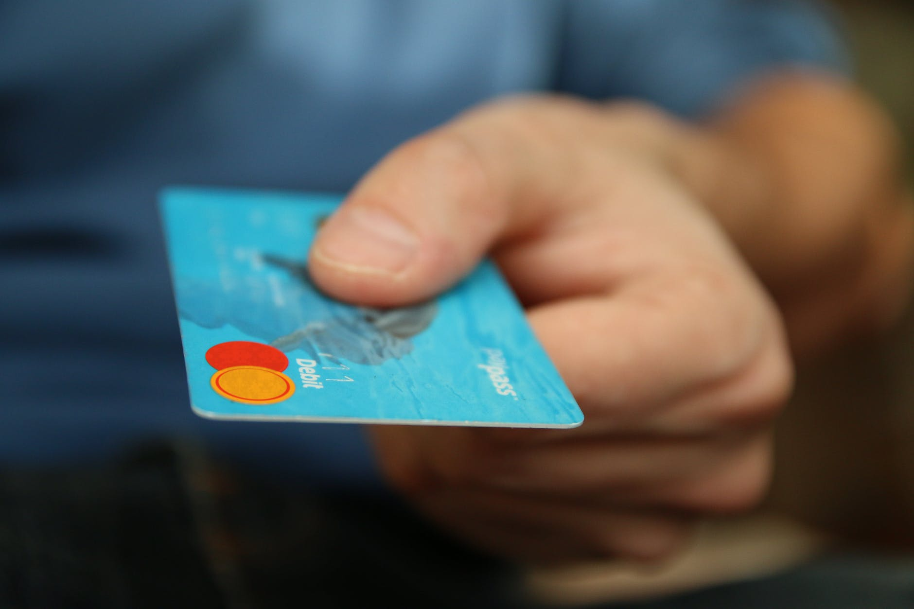

On January 1st 2021, Twitter suffered a data breach that resulted in the exposure of over 200 million email addresses. Recently, these exposed credentials appeared on the dark web, causing concern for individuals whose information was included in the leak.

Fortunately, no passwords were leaked in the breach. However, this does not mean that there are no potential dangers associated with having your email address included in the data breach. Here are a few ways that this event could put you at risk:

**Credential stuffing**

<figure>

<figcaption>

Photo by Tima Miroshnichenko on [Pexels.com](https://www.pexels.com/photo/three-people-hacking-a-computer-system-5380643/)

</figcaption>

</figure>

Credential stuffing is a type of cyber attack in which hackers use a list of compromised login credentials (usually obtained through a data breach) to automate login attempts on other websites. The attackers will typically use a program to try the leaked username and password combinations on a large number of websites in an attempt to find accounts where the user has reused the same login information. If the attackers are successful in logging into one of the accounts, they may then attempt to use that account to gain access to other accounts or steal sensitive information. To protect yourself from credential stuffing attacks, it is important to use unique, strong passwords for each of your online accounts and to enable two-factor authentication whenever possible.

**Email spoofing**

Email spoofing refers to the practice of sending emails that appear to be from a different sender than the actual source. This can be done for a variety of reasons, including phishing attacks, spamming, and to spread malware. If your email address has been included in a data breach, it is possible that someone could use it to send spoofed emails that appear to be from you. This could potentially cause problems for you if the emails contain inappropriate or malicious content. To protect yourself from email spoofing, you can use email authentication techniques such as SPF, DKIM, and DMARC. These techniques help to verify that an email was actually sent by the domain it claims to be sent from, and can help to reduce the chances that your email address will be used for spoofing.

**Phishing attacks**

Phishing attacks are a type of cybercrime in which scammers attempt to trick individuals into revealing sensitive information or login credentials by pretending to be a trustworthy source. Scammers may try to use the information from the data breach to send you convincing phishing emails or texts, attempting to trick you into giving them sensitive information or access to your accounts. To protect yourself from phishing attacks, be cautious about responding to suspicious emails or messages that ask for your personal information or login credentials. Be especially wary of emails or messages that create a sense of urgency or fear, or that ask you to click on a link or download an attachment.  

**Spam**

You may start to receive more spam emails as a result of your email address being included in the data breach. Spam emails are unsolicited messages that are often sent in large quantities, and can range from annoying advertisements to dangerous phishing attempts. To protect yourself from spam, use spam filters and be cautious about opening emails from unfamiliar senders. If you do receive a spam email, do not click on any links or download any attachments it contains.  

**Identity theft**

<figure>

<figcaption>

Photo by Pixabay on [Pexels.com](https://www.pexels.com/photo/shopping-business-money-pay-50987/)

</figcaption>

</figure>

Identity theft occurs when someone uses your personal information (such as your name, address, or financial information) to commit fraud or other crimes. If other personal information about you (such as your name or address) was included in the data breach, someone could potentially use that information to steal your identity. To protect yourself from identity theft, it is important to monitor your credit reports and financial accounts for any unusual activity. You should also be careful about the information you share online and be wary of giving out personal information to untrusted sources. If you suspect that your identity has been stolen, it is important to take action quickly to minimize the damage and protect yourself.  

One way to further protect yourself from the risks associated with having your email address exposed in a data breach is to use an email masking service. Email masking services allow you to create disposable or "masked" email addresses that can be used in place of your real email address when signing up for online accounts or services. This can help to protect your real email address from being exposed to potential threats like spam, phishing, and identity theft. Some examples of email masking services include [Hide My Email](https://support.apple.com/en-gb/HT210425) by Apple and [Firefox Relay](https://relay.firefox.com/) by Mozilla.  

In addition to the risks mentioned above, it is important to note that data breaches can have other consequences as well. For example, your personal information may be sold on the black market, or you may experience financial losses as a result of fraud or identity theft.

If you think that your email address may have been included in the Twitter data breach, it is a good idea to take steps to protect yourself. This may include changing your password, enabling two-factor authentication, and using a password manager to generate and store strong, unique passwords for your online accounts. It is also a good idea to be cautious about the information you share online and to be aware of potential threats like phishing attacks.

To check if your personal data has been exposed in any data breaches, you can use the website **[Have I Been Pwned](https://haveibeenpwned.com/)**. This website allows you to enter your email address and see if it has been included in any known data breaches. If your email address has been exposed, it is important to take steps to protect yourself and your personal information.  

In conclusion, the recent Twitter data breach and the exposure of over 200 million email addresses raises important questions about the trust we place in social media and websites with our personal data. Data breaches can have serious consequences for individuals, including the risk of credential stuffing, email spoofing, phishing attacks, spam, and identity theft. Yet, there are often no legal consequences for the companies responsible for these breaches, and individuals are left to bear the burden of protecting themselves and their personal information.

It is time for us to take control of our data and demand more protection and accountability from the companies that collect and store it. One way to do this is to only allow websites to access encrypted data, rather than giving them access to our personal information in an unencrypted form. This would help to safeguard our data and reduce the chances of it being exposed in a data breach. It is also important for lawmakers to address the issue of data breaches and ensure that there are consequences for companies that fail to protect the personal information of their users. By taking these steps, we can help to create a safer and more secure online environment for everyone.
