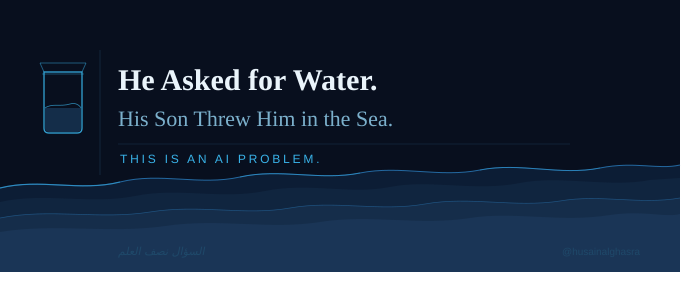

<figure>

</figure>

> *السؤال نصف العلم*
> The question is half the knowledge.

A problem well stated is a problem half solved. So said Charles Kettering, inventor and engineer, long before artificial intelligence became the discipline it is today.

But in Arabic, we have a saying that goes a little deeper: *السؤال نصف العلم* -- the question is half the knowledge. In another form, *السؤال نصف الإجابة* -- the right question is half the answer.

The difference matters. Kettering speaks about stating. The Arabic saying speaks about asking, which implies curiosity, humility, and the willingness to search. What is knowledge without a question? What is a search without the willingness to find?

Articulating the question properly is already halfway through the answer. And I think that feels very true in AI.

## The man and the sea

To illustrate what happens when a problem is poorly stated, consider this: an elderly man asks his son for water. The son throws him into the sea.

You could argue the son did exactly what was asked. But the father did not specify he needed water to drink, in a cup, at a reasonable temperature, without drowning. Maybe he was too thirsty to list every constraint. Maybe he assumed the outcome was obvious. But he had an expectation -- a broad, human expectation -- and it was catastrophically missed.

This is one of the most important implications for AI. An agent operating on a poorly stated problem will optimise faithfully toward the wrong thing. It will complete the task and consider itself successful.

And the danger is compounded by the fact that we often only see outcomes, not process. We may perceive a correct answer arrived at through entirely wrong reasoning, which is a separate problem in itself.

The goal, the boundary, and the solution space must be defined, even if broadly. Not every constraint needs to be listed, but the intended outcome must be clear. The father wanted relief from thirst. That should have been the goal state.

## Can a problem be over-stated?

Yes. And I think this failure mode is underappreciated.

Russell and Norvig describe the quest for artificial flight, and how it only succeeded when engineers stopped trying to imitate birds and started studying aerodynamics. Those early attempts failed, I would argue, because the problem was over-stated. Too many constraints were built around mimicking the solution rather than achieving the goal. The over-statement prevented people from seeing the wider solution space entirely.

In my own field, we actively remind stakeholders not to "solutionise" when describing a problem. When someone frames a requirement as a specific solution rather than a need, it does three things:

- It narrows the search space artificially.
- It embeds assumptions invisibly.
- It often delivers something that does not actually eliminate the problem it was meant to solve.

Over-stating a problem shifts focus from the destination to the road. And sometimes, the best road is one you have not drawn yet.

## Bringing it together

Perhaps the art of AI problem design is not so different from good requirements work: define the outcome clearly, resist the urge to define the path, and leave enough space for the solution to surprise you.

A problem well stated sets the goal.
A problem over-stated builds the cage.

I am writing this as someone mid-way through studying AI, not as an expert, but as someone who finds that the deeper you go into the technical side of artificial intelligence, the more human the fundamental questions become.

How we frame a problem shapes everything that follows. The goal state determines what success looks like. The constraints determine what the agent can and cannot do. The absence of a constraint is not freedom -- it is an invitation for the river to flood.

And that, I think, is worth pausing on. Whether you are building an AI system, leading a team, or just asking an elderly man if he needs a glass of water.
