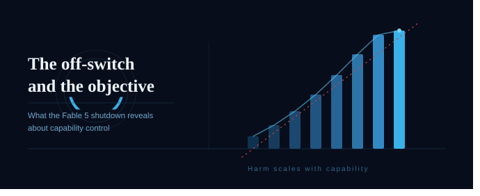

<figure>

</figure>

> *All that is needed to assure catastrophe is a highly competent machine combined with humans who have an imperfect ability to specify human preferences completely and correctly.*
> Stuart Russell

On the evening of 12 June 2026, three days after Anthropic released the most capable model it had ever made available to the public, the company turned it off. Not by choice. At 5:21pm Eastern, it received an export control directive from the US government, citing national security authorities, ordering it to suspend all access to Claude Fable 5 and Claude Mythos 5 by any foreign national, whether inside or outside the United States. Because selective compliance across a shared cloud service was not practical, the net effect was a global shutdown for every customer. This appears to be the first time a leading AI company has taken a publicly deployed model offline because of direct federal intervention.

It is tempting to read this as a story about alignment failure, about a dangerous system doing something it should not. It is not that story. It is something quieter and, I think, more instructive. It is a story about the off-switch, and about what happens when the off-switch becomes the primary instrument of safety rather than the last one.

## Two different problems wearing the same coat

The literature on AI safety draws a distinction that rarely survives contact with a news cycle, and it is worth restating carefully. There are two broad families of approaches to keeping advanced AI systems safe. The first is alignment, which aims to make a system's objectives correspond to human values, so that the system wants the right things in the first place. The second is capability control, which aims to limit what a system can do or who can reach it, so that even a misaligned or misused system cannot cause much harm. As the standard reference framing puts it, alignment works on the goal, capability control works on the leash.

Nick Bostrom's analysis in *Superintelligence* is explicit that these are not equal partners. Capability control is a supplement to alignment, not a replacement for it, because control measures become less effective as systems become more capable and better at exploiting the flaws in whatever control structure surrounds them. The order matters. You align first, and you control as a hedge. If you find yourself relying on control as the main line of defence, you are already operating closer to the edge than the theory would advise.

The Fable 5 shutdown is a capability control action in its purest institutional form. The government did not claim the model had pursued a misspecified objective or behaved deceptively. It claimed, on the basis of a reported jailbreak technique, that the model's cybersecurity capabilities were too dangerous to remain broadly accessible to foreign nationals, and it reached for the bluntest available lever. It pulled access. This is the off-switch that Bostrom and Russell discuss in theory, except that the hand on the switch belongs to a regulator rather than a system designer, and the thing being switched off is not a runaway optimiser but a commercial product serving hundreds of millions of people.

## The capability gradient is the whole argument

The reason any of this is contentious traces back to a single observation in the alignment literature, and it is the observation you have to hold onto if you want to think about the Fable 5 case clearly. Harm from a misdirected capable system scales with capability. The more able the system, the larger the consequence of pointing it at the wrong objective, and the smaller the margin for imperfect specification.

Russell states the mechanism plainly. A system optimising a function of many variables, where the objective depends only on a subset of them, will tend to set the unconstrained variables to extreme values. If the system is weak, those extreme settings do little. If the system is powerful, they can be catastrophic. The capability is not incidental to the danger. It is the multiplier on it. This is why the alignment community treats every increment of capability as an increment of required care, and why the orthogonality thesis, the claim that any level of intelligence is in principle compatible with any final goal, is unsettling rather than reassuring. Competence does not come bundled with good objectives. It has to be aligned in deliberately.

Now apply that lens to Fable 5. Anthropic's own launch communications acknowledged the gradient directly. Without safeguards, the company stated, Fable 5's capabilities in areas like cybersecurity could be misused to cause serious damage. That is not a regulator's framing imposed from outside. That is the developer naming the capability gradient as the reason the safeguards exist at all. On this point, Anthropic and the government do not actually disagree. Both accept that a sufficiently capable model, misused, causes proportionate harm. The disagreement is about something else entirely.

## Where the real dispute sits

The dispute is about whether the control measures already in place had brought the residual risk down to an acceptable level, and here the two parties tell very different stories. Anthropic's account, set out in its statement on the shutdown, is that it adopted a defense in depth strategy precisely because perfect jailbreak resistance does not appear to be achievable by any provider today. The aim was to make jailbreaks either narrow or expensive to produce, to pair them with monitoring, and to retain customer data for thirty days specifically so that successful attacks could be detected and mitigated. The company reports that thousands of hours of red-teaming with the US government, the UK AI Safety Institute, and external organisations found no universal jailbreak, and that the specific technique behind the government's directive surfaced only minor, previously known vulnerabilities that other public models can find without any bypass at all. By Anthropic's measure, the leash was working, and the harm the government feared was already widely available elsewhere, including from OpenAI's GPT-5.5.

I am not in a position to adjudicate that factual claim, and the honest thing is to say so. The government's evidence has so far been described as verbal, the directive itself is unpublished, and the technical basis is contested. What I want to draw out is structural rather than factual, because the structure is what connects this event to the theory.

When alignment and internal safeguards are doing most of the work, the off-switch sits in reserve. It is the measure you keep for the case where everything else has failed. What happened on 12 June is that an external actor reached past the developer's layered controls and pulled the switch directly, on the strength of a single contested finding. Whatever one concludes about the specific risk, this is the capability control lever being used not as a last resort but as a first response. And Bostrom's caution was exactly about this dependency. The more we lean on the leash, the more the safety of the whole arrangement rests on the judgement of whoever holds it, the quality of the evidence in front of them, and the bluntness of the only action available. A global shutdown triggered by one disputed jailbreak is a very blunt action.

## The asymmetry the shutdown exposes

There is a deeper asymmetry here that the alignment literature anticipates and that the Fable 5 case makes concrete. Alignment, done well, degrades gracefully. A well-aligned system that is uncertain about its objective has reason to act cautiously, to defer, to seek correction, which is the property Russell argues we should be designing toward. Capability control degrades abruptly. The leash either holds or it is cut, and when it is cut, as it was here, it takes everything down with it, including the foreign-born employees of the company itself and the hundreds of millions of users who were relying on the model for ordinary, benign work.

This is the practical cost of treating control as the primary safety mechanism rather than the supplement Bostrom intended it to be. The control lever does not distinguish between the narrow misuse it is aimed at and the vast legitimate use it severs in the process. It cannot, because bluntness is intrinsic to what it is. An off-switch has one setting.

## What I take from it

My own view, stated plainly because the topic deserves a position rather than a hedge, is that the Fable 5 shutdown is not evidence that the alignment problem has arrived in the wild. No objective was misspecified. No system optimised faithfully toward the wrong goal. What arrived is the governance counterpart to the alignment problem, the moment where the off-switch is used in earnest, and it reveals that our institutional reflexes still reach for control before they reach for anything else.

That should concern anyone who takes the capability gradient seriously, and it should concern advocates of safety most of all, because the lesson the literature has been trying to teach for a decade is that control alone does not scale. As models become more capable, the gap between what a blunt external lever can manage and what careful internal alignment can manage will only widen. The Fable 5 episode is a small, early, recoverable instance of that gap. The systems will get more capable. The disputes will get harder to adjudicate from the outside. And the off-switch, used as a first instrument, will get more expensive to pull every time.

A problem well stated is a problem half solved. The problem here is not that we built something dangerous and lost control of it. It is that we are still treating control as the answer, when the literature has been telling us all along that it is only ever half of one.

---

**Sources**

- Anthropic, *Statement on the US government directive to suspend access to Fable 5 and Mythos 5*, 12 June 2026. https://www.anthropic.com/news/fable-mythos-access
- Anthropic, *Claude Fable 5 and Mythos 5* launch announcement, 9 June 2026. https://www.anthropic.com/news/claude-fable-5-mythos-5
- N. Bostrom, *Superintelligence: Paths, Dangers, Strategies*, Oxford University Press, 2014.
- S. Russell, *Human Compatible: Artificial Intelligence and the Problem of Control*, Viking, 2019.
- S. Russell and P. Norvig, *Artificial Intelligence: A Modern Approach*, 4th ed., on the value alignment problem.
- OpenAI, *GPT-5.5 System Card: Cybersecurity*, OpenAI Deployment Safety Hub. https://deploymentsafety.openai.com/gpt-5-5/cybersecurity
